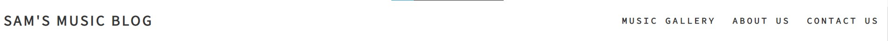

# Sam's Music Blog

## Welcome!

This website is designed to showcase up-and-coming producers and artists and provide a platform for them to promote their music to a wider audience.

https://ui.dev/amiresponsive

# Features

## Existing Features

* ### Navigation Bar
  * Easily navigate through the website using the top navigation bar.
  * Can be seen on both pages, includes the logo and the navigation bar.
  * Includes: Music Gallery, About Us, Contact Us. This will link to the diffrent sections of the page.
  * The navigation bar tells the user where they can find the different sections and what they can expect when clicked on.  

* ### The landing page image
  * The image is capturing the visitors attention and setting the mood.
  * The image fits in with the rest of the site making the site look more proffesional.

* ### Music Gallery
  * Users can discover new and exciting music form up-and-coming artists.
  * This is valuable for artist looking for a new ways to showcase their work.
  * This is valuable for visitors looking for new music.
"image"

* ### Send In Your Music!
  * This section provides a platform for emerging artists to showcase their work and potentially gain exposure to a wider audience.
  * Encouraging engagement: This section provides a clear call-to-action for visitors to send in their music.

* ### About Us
  * The About Us section gives details of what we offer to the users.
  * The About Us section gives you information on how you can send in your music. 

* ### Contact Us
  * Provides a direct line of communication
  * Improving user experience and credibility
  * The contact us section is valuable if the users have any unaswered unanswered questions or suggestions.

* ### The Footer
  * The footer includes several social media links for Sam's Music Blog, the links will open in a new tab.
  * The footer is valuable as it improves user experience and encourages users to keep up with Sam's Music Blog through social media.
# Testing

### Bugs
#### Solved Bugs

## Validator Testing
#### HTML
#### CSS
#### Accessibility

# Deployment

# Credits
## Content
## Media