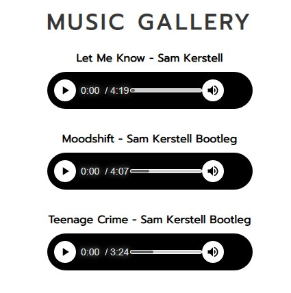
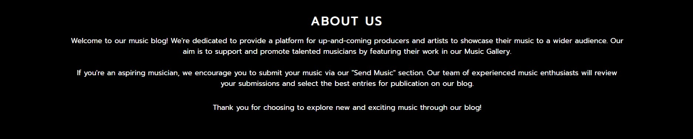
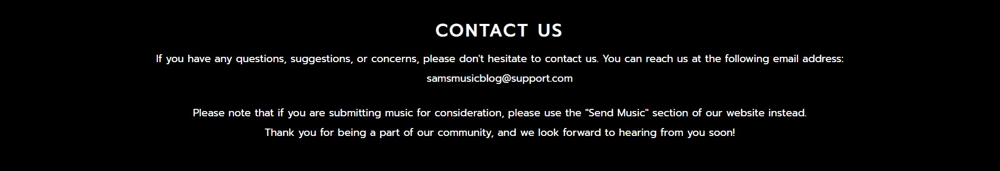

# Sam's Music Blog

## Welcome!

This website is designed to showcase up-and-coming producers and artists and provide a platform for them to promote their music to a wider audience.

# Features

## Existing Features

* ### Navigation Bar
  * Easily navigate through the website using the top navigation bar.
  * Can be seen on both pages, includes the logo and the navigation bar.
  * Navigation bar includes: Music Gallery, About Us, Contact Us. This will link to the diffrent sections of the page.

* ### The landing page image
  * The image is capturing the visitors attention and setting the mood.
  * The image fits in with the rest of the site making it look more proffesional.

* ### Music Gallery
  * Users can discover new and exciting music form up-and-coming artists.
  * This is valuable for artist looking for a new ways to showcase their work.
  * This is valuable for visitors searching for new music.

* ### Send In Your Music!
  * This section provides a platform for emerging artists to showcase their work and potentially gain exposure to a wider audience.
  * Encouraging engagement: This section provides a clear call-to-action for visitors to send in their music.

* ### About Us
  * The About Us section gives details on what the site offers to the user.
  * The About Us section gives you information on how you can send in your music. 

* ### Contact Us
  * Provides a direct line of communication.
  * Improving user experience and credibility.
  * The contact us section is valuable if the users have any unanswered questions or suggestions.

* ### The Footer
  * The footer includes several social media links for Sam's Music Blog, the links will open in a new tab.
  * The footer is valuable as it improves user experience and encourages users to keep up with Sam's Music Blog through social media.
# Testing
* I've tested that this site works in different browsers: Chrome, Opera, Safari
* I've tested that the site is responsive and looks good on different devices.
* I've tested that the form works and requires Email, Name and Song Name to submit.
* I've tested that the footer works and all links opens in a new tab.

### Bugs
Fieldset styling is not working properly in firefox.

#### Solved Bugs
Whenever I tried to send in a file I would just get the "Error code: 501".
I fixed it by making a new html page and adding confirmation.html to the form action.

## Validator Testing
* HTML
  * No errors were returned when passing through the official [W3C validator](https://validator.w3.org)
* CSS
  * No errors were found when passing through the official [(Jigsaw) validator](https://jigsaw.w3.org/css-validator/)
#### Accessibility

#### Technology Used

 ## Languages Used
 * HTML5
 * CSS3

# Deployment
* The site was deployed to GitHub pages. The steps to deploy are as follows:
  * In the GitHub repository, navigate to the Settings tab
  * From the source section drop-down menu, select the Master Branch
  * Once the master branch has been selected, the page will be automatically refreshed with a detailed ribbon display to indicate the successful deployment.
The live link can be found here - [Sam's Music Blog](https://samuelkerstell.github.io/portfolio-project-1/index.html)

# Credits
## Content
* The CSS styling from the footer was taken from the [Love Running Project](https://github.com/samuelkerstell/love-running)
* Instructions on how stick the footer to the bottom of the page was taken form this [page](https://dev.to/nehalahmadkhan/how-to-make-footer-stick-to-bottom-of-web-page-3i14)
* Instructions on how to style audio element was taken from this [blog page](https://blog.shahednasser.com/how-to-style-an-audio-element/)
* Instructions on how to center an audio element was take from this [page](https://stackoverflow.com/questions/16823868/center-html-5-audio-players-for-all-browsers)
## Media
* The landing page image was taken from [Pexels](https://www.pexels.com/photo/grayscale-photography-of-person-using-dj-controller-860707/)